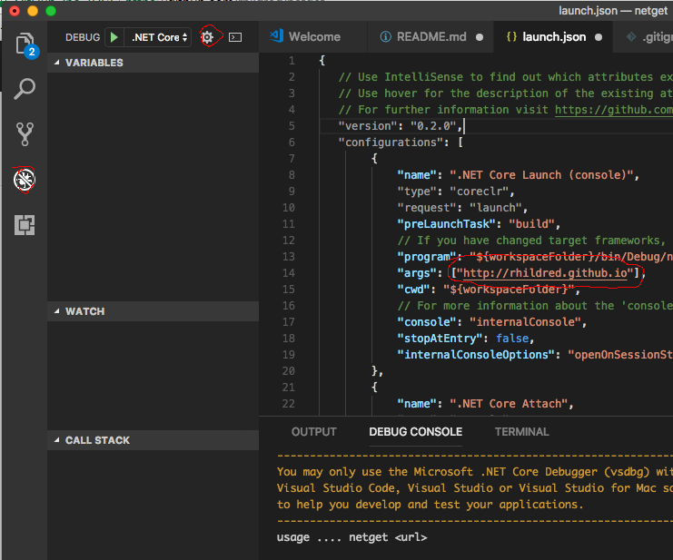
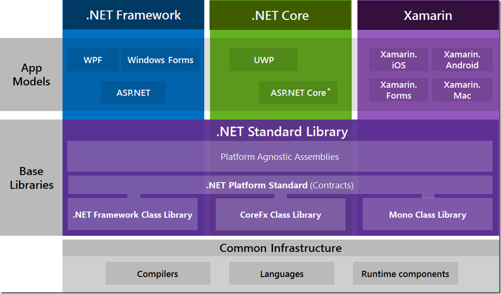
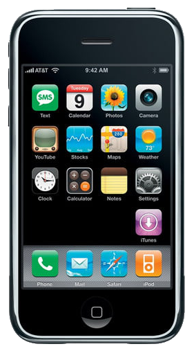
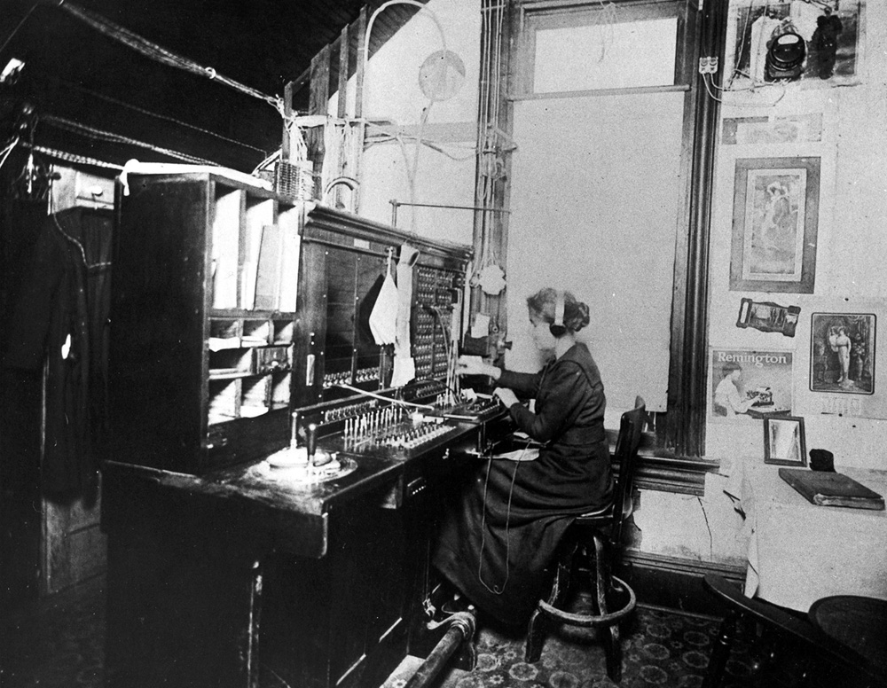
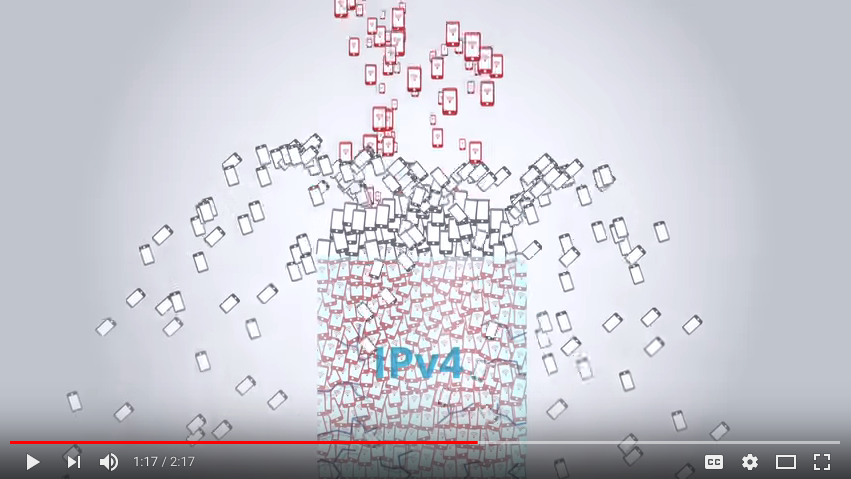
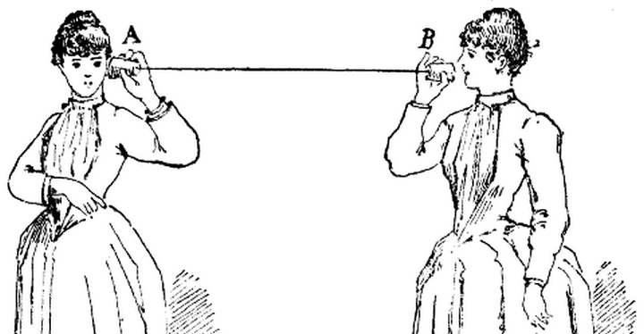

# [.netget](https://github.com/rhildred/netget)
## gets a url using .net core

This is a project for my 2nd term INFO1380 networking class. More about networking then about .net core. This class has had a 1 semester introduction to programming in .net. I am developing this on OSX/macos during reading week. OSX because I have OSX from when a friend and I started a software company in the Waterloo Ontario Accelerator Center. All of the cool software startups ran OSX!

To get running I:

1. Installed vscode [from here](https://code.visualstudio.com/download).
1. Installed .net core [from here](https://www.microsoft.com/net/download/macos).
1. Added the C# powered by OmniSharp extension in vscode.

In vscode I:

1. Opened a new folder.
1. Opened a terminal window and ran `dotnet new console`.
1. Opened the resulting Program.cs and pressed `Ctrl-F5`.
1. Clicked `yes` on the following dialog.


The next time I pressed `Ctrl-F5` I was treated to:


Then I replaced all of the code in Program.cs with this, my first networking code!!!!!:

```

using System;
using System.Net.Http;
using System.Threading.Tasks;

namespace helloC_
{
    class Program
    {
        private static readonly HttpClient client = new HttpClient();
        private static async Task ProcessRepositories(string sUrl)
        {
            var stringTask = client.GetStringAsync(sUrl);

            var msg = await stringTask;
            Console.Write(msg);
        }
        static void Main(string[] args)
        {
            if(args.Length > 0){
                ProcessRepositories(args[0]).Wait();
            }else{
                Console.WriteLine("usage .... " + System.AppDomain.CurrentDomain.FriendlyName + " <url>");
            }
        }
    }
}


```

Then when I pressed `Ctrl-F5` I was treated to this:


Almost there! To get `args[0]` populated I had to change the debug config in `.vscode/launch.json` to add to the `args[]`.



Finally when I pressed `Ctrl-F5` I was treated with:


Whoa! What just happened here? Well it turned out that a lot had to go right for this to work. All of that is the true thrust of this networking course.

## Divide and conquer with layers

Have you seen a picture that looks like this before?



Because my application is written to the .net core layer it will run on Windows, Linux and OSX. Networking also uses a layered approach.


The line of code:

```

    var stringTask = client.GetStringAsync(sUrl);

```

sends this `GET / HTTP/1.0` request to the web server host `rhildred.github.io`. As you may have guessed from the domain name this host is part of a social network for programmers called github. You will be learning in a few weeks hot to put your own html code from last term on github. 

## Encapsulation

If you haven't learned this already encapsulation in object oriented programming is combining data and the methods and metadata that work on that data into one package. It is a good idea because consumers of the object don't need to know the internals of the object to use it. Encapsulation hides the object from the consumers of that object. The implementation can then change without the consumers being affected.

Encapsulation in networking is similar. As we go through the layers we add header code to the data from the layer above. The header code is used to do the right thing to send the data to the next layer below. The header code has addressing and state information in it for each layer.



Part of the big leap forward with this device is that as well as SMS and digital calls it also used plain IP over the cellular network. The IP layer was then able to support a regular Safari like WebKit browsing experience and the smart phone really took off.

### Application Layer

Like that browser our application is using the http service in the application layer. In .net core the http service is provided by the HttpClient object which is created with:

```

private static readonly HttpClient client = new HttpClient();

```

We call a method on that object:

```

    var stringTask = client.GetStringAsync(sUrl);

    var msg = await stringTask;
    Console.Write(msg);


```

wait for and print the result. 

Under the covers the HttpClient uses another application service DNS to get the IP address of that rhildred.github.io server.

```

helmsdeep:netget rhildred$ nslookup rhildred.github.io
Server:         2607:fea8:1cdf:f4a0:aa4e:3fff:fed0:73c2
Address:        2607:fea8:1cdf:f4a0:aa4e:3fff:fed0:73c2#53

Non-authoritative answer:
rhildred.github.io      canonical name = sni.github.map.fastly.net.
Name:   sni.github.map.fastly.net
Address: 151.101.125.147


```

Then the WebClient opens a socket to `151.101.125.147:80`.

### Transport Layer



The word socket predates networking. We plug something in to a socket to complete a circuit. The transport layer creates a circuit between 2 applications. In this case our WebClient app and the web server at http://rhildred.github.io.

### Network Layer

TCP/IP started as a military project with 3 goals:

* Survive a nuclear strike
* Permit different computer systems from different Nato allies to communicate easily
* Interconnect systems even into space

The network layer realizes these goals by routing packets individually, potentially around smoking holes. The French had little gourmet packets in their ATM networks while even packets are bigger in Texas. The network layer can fragment packets to work with different systems. Finally the network layer is responsible for addressing nodes for communication. With the new IPV6 network layer 128 bit addresses we can have 340 trillion, trillion trillion addresses. Even with IPV4 networks 32 bit addresses we can have 4.3 billion nodes. 



With name address translation (NAT) we have been able to make many more private IP addresses be behind many fewer public IP addresses so that our hit applications can run on the worlds 5.5 billion cellphones.

### Link Layer



The link layer is responsible for the physical transmission of the signal. Link layer mediums in common use are twisted pair cables, coaxial cables, fiber and the radio spectrum. Like our tin can telphone example where the medium is a taut string some media can only send one signal at a time. Senders and receivers must take turns. The link layer mediates turn taking in what we call a half duplex mode. Other media like twisted pair has one pair of wires for transmission and 1 pair for receiving. In this full duplex case the sender and receiver can work simultaneously. There is also a mode of using mostly radio spectrum called simplex. This is the case that we are used to from car radios and network television.

## OSI Model

TCP/IP was developed as a defence project in the 1960s to: 

* Survive a nuclear strike
* Permit different computer systems from different Nato allies to communicate easily
* Interconnect systems even into space


The OSI model was developed later as a theoretical model. One can think of the OSI model as adding 3 layers to TCP/IP. 

### Physical Layer

TCP/IPs Link layer was effectively split in 2 in the OSI model. The OSI model recognized that things like turn taking could be done in the same way in different physical media.

### Session Layer

The session layer was put in between the application and the transport layer. Session layer is important to programmers as a way to think about peer to peer communications as opposed to client server. In peer to peer communications like voice over ip or torrenting a machine on the internet is used to set up a socket between 2 other machines potentially behind a NAT. In Session Initialization Protocol (SIP) and WebRTC Session Traversal Utilities for NAT (STUN) are used on a machine on the internet to punch a hole into the NAT that a socket can be connected through.

### Presentation Layer

The presentation layer was important in the 80s when file servers and print servers were the killer applications for Networking. The presentation layer can be thought of as what makes our g: drives appear as a local drive on every computer that we log on to at school. 
